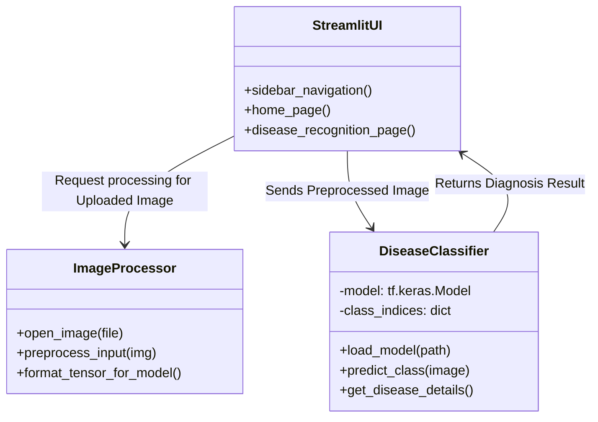

# 🌱 KHASYAPIX - FieldPlant A Dataset of Field Plant Images for Plant Disease Detection and classification with deep learning

A modern, AI-powered web application that helps farmers and agricultural professionals detect plant diseases from leaf images using advanced machine learning techniques.

## ✨ Features

- **🔬 AI-Powered Detection**: Identifies 38 different plant diseases with high accuracy
- **🌍 Sustainable Agriculture**: Supports eco-friendly farming practices
- **📱 Modern UI**: Beautiful, responsive interface with dark/light themes
- **🎨 Animations**: Smooth transitions and interactive elements
- **🌐 External Access**: Accessible from any device on your network
- **📊 Real-time Analysis**: Instant disease diagnosis with detailed information

## 🌿 Supported Plants

The system can detect diseases in the following plants:
- 🍎 Apple
- 🫐 Blueberry  
- 🍒 Cherry
- 🌽 Corn
- 🍇 Grape
- 🍊 Orange
- 🍑 Peach
- 🫑 Pepper
- 🥔 Potato
- 🍓 Raspberry
- 🫘 Soybean
- 🎃 Squash
- 🍓 Strawberry
- 🍅 Tomato

## 🚀 Quick Start

### Option 1: Windows Users (Recommended)
1. Double-click `run_app.bat`
2. The application will automatically install dependencies and start
3. Your browser will open automatically

### Option 2: Manual Installation
1. Install Python 3.7+ from [python.org](https://python.org)
2. Install required packages:
   ```bash
   pip install -r requirements.txt
   ```
3. Run the application:
   ```bash
   python run_app.py
   ```

### Option 3: Direct Streamlit
```bash
streamlit run main.py --server.address 0.0.0.0 --server.port 8501
```

## 🌐 Access URLs

- **App Link**: https://khasyapix.streamlit.app
- **Website Lnk**: https://khasyapix.lovable.app

  
## 📱 How to Use

1. **Upload Image**: Click "Choose an Image" and select a clear photo of a plant leaf
2. **Preview**: Click "Show Image" to preview your uploaded image
3. **Analyze**: Click "Predict Disease" to get instant AI-powered diagnosis
4. **Review Results**: View the disease identification and detailed information

## 💡 Tips for Best Results

- **📷 Image Quality**: Use clear, well-lit images with good contrast
- **🍃 Leaf Focus**: Ensure the leaf is the main subject and covers most of the frame
- **🔍 Detail Level**: Include visible disease symptoms or spots for accurate detection
- **📐 Format**: Supported formats: JPG, PNG, JPEG

## 🎨 UI Features

- **🌙 Dark/Light Theme**: Toggle between themes using the button in the top-right corner
- **📱 Responsive Design**: Works perfectly on desktop, tablet, and mobile devices
- **✨ Smooth Animations**: Beautiful transitions and hover effects
- **🎯 Modern Layout**: Clean, professional interface with proper spacing

## ⚙️ System Architecture

### 🔄 High-Level Workflow
The application follows a streamlined workflow using Streamlit for the user interface and TensorFlow/Keras for AI inference.

```mermaid
graph TD
    User([🌾 Farmer / User]) -->|Uploads Leaf Image| UI[💻 Streamlit Web Interface]
    
    subgraph Frontend [🎨 User Interface Layer]
        UI -->|Image Data| Preview[🖼️ Image Preview]
        UI -->|Triggers| AnalyzeBtn[🧪 Predict Disease]
    end

    subgraph Backend [⚙️ Processing Layer]
        AnalyzeBtn -->|Routes Request| Processor[🔄 Image Preprocessing]
        Processor -->|Resizes & Normalizes| Format[📏 Format for Model]
    end

    subgraph ML_Model [🧠 Machine Learning Engine]
        Format -->|Input Tensor (224x224x3)| ModelNode[🤖 MobileNetV2 Keras Model]
        ModelNode -->|Extracts Features| Classifier[📊 Dense Classification Layer]
        Classifier -->|Outputs Probabilities| LabelMatch[🏷️ Map to 38 Disease Classes]
    end

    LabelMatch -->|Diagnosis Result| Storage[📂 Result Generation]
    Storage -->|JSON Data| Display[📈 Disease Identification & Info]
    Display -->|Update UI| UI
```

### 🧱 Component Architecture
A brief view of the core modules handling the image prediction lifecycle.



## 🔧 Technical Requirements

- Python 3.7+
- TensorFlow 2.x
- Streamlit
- NumPy
- Pillow (PIL)
- OpenCV
- Pandas
- Matplotlib
- Seaborn
- Scikit-learn

## 📁 Project Structure

```
Plant-Disease-Detection-System/
├── main.py                          # Main application file
├── run_app.py                       # Startup script with auto-setup
├── run_app.bat                      # Windows batch file for easy startup
├── requirements.txt                 # Python dependencies
├── .streamlit/
│   └── config.toml                  # Streamlit configuration
├── trained_plant_disease_model.keras # Pre-trained AI model
├── Dataset/                         # Training dataset
│   ├── train/                       # Training images
│   └── valid/                       # Validation images
└── test/                           # Test images
```

## 🛠️ Troubleshooting

### Common Issues

1. **Model Not Found**: Ensure `trained_plant_disease_model.keras` is in the project directory
2. **Port Already in Use**: Change the port in `run_app.py` or kill the existing process
3. **Permission Errors**: Run as administrator on Windows
4. **Slow Loading**: The model loads on first use - subsequent predictions are faster

### Network Access Issues

- **Firewall**: Allow Python/Streamlit through Windows Firewall
- **Antivirus**: Whitelist the application folder
- **Router**: Ensure your device is on the same network

## 🤝 Contributing

We welcome contributions! Please feel free to submit issues, feature requests, or pull requests.

## 📄 License

This project is open source and available under the MIT License.

## 🙏 Acknowledgments

- Dataset: PlantVillage dataset for training images
- Framework: Streamlit for the web interface
- AI: TensorFlow/Keras for the machine learning model
- Icons: Emoji icons for visual appeal

---

**🌱 Helping farmers worldwide with AI-powered plant disease detection!**
